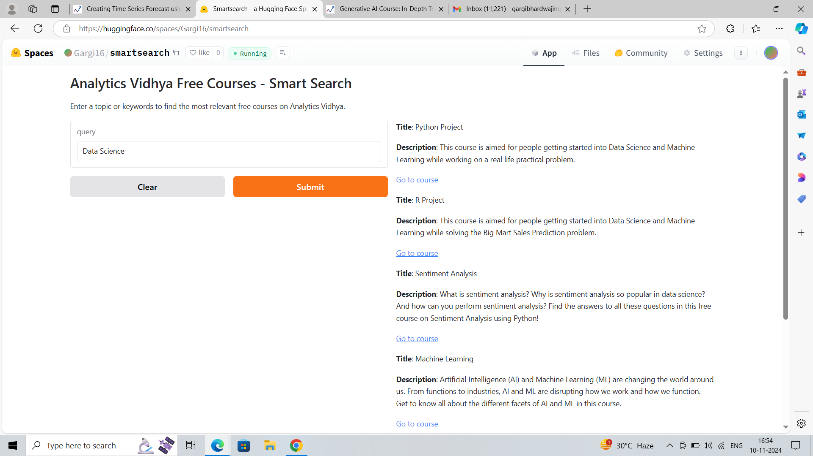
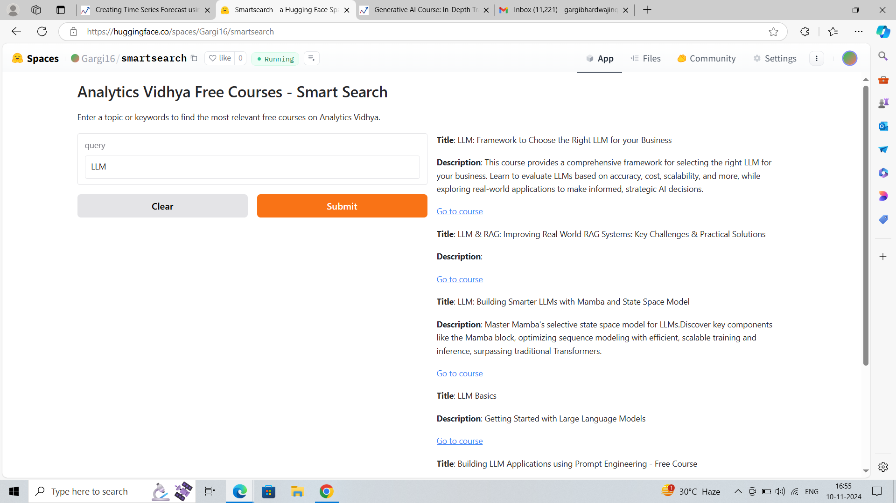

---

# 🔍 Analytics Vidhya Free Courses - Smart Search

Welcome to the **Smart Search Tool** for free courses on Analytics Vidhya! This project is designed to help users quickly find the most relevant courses based on their search terms, using the power of Large Language Models (LLMs) and semantic search technology. The tool is deployed on [Huggingface Spaces](https://huggingface.co/spaces), allowing easy access to anyone interested in exploring the free course catalog.

## 📜 Project Overview

**Smart Search Tool** uses a pre-trained language model to generate course embeddings and calculate semantic similarity between user queries and course descriptions. The system performs a two-step search:
1. **Keyword Matching**: First, the tool searches for an exact keyword match in course titles.
2. **Semantic Similarity**: If no keyword matches are found, the tool uses embeddings to perform a semantic similarity search, ensuring the most relevant courses are shown.

With this setup, users can find courses based on topics, keywords, or even general concepts!

## 🧰 Tech Stack

- **Language Model**: [Sentence-Transformers](https://www.sbert.net/) (`all-MiniLM-L6-v2`) for embedding generation.
- **Frontend Framework**: [Gradio](https://gradio.app/) for an interactive user interface.
- **Deployment**: [Huggingface Spaces](https://huggingface.co/spaces) for easy accessibility.

## 🚀 Features

1. **Keyword-Based Search**: Quickly finds courses with keywords (e.g., "LLM") directly in the course title.
2. **Semantic Search**: Uses embeddings to find relevant courses when direct keyword matches aren’t available.
3. **Simple Interface**: Users can enter a search term and view the top matching courses with a single click.
4. **Interactive Results**: Each result includes the course title, description, and a direct link to the course page.

## 📁 Data

The tool uses a dataset of free courses available on Analytics Vidhya, stored in a `courses.json` file structured like this:

```json
[
    {
        "title": "Course Title 1",
        "description": "Detailed description of Course 1.",
        "link": "URL to Course 1"
    },
    ...
]
```

## 🖥️ Installation and Setup

To run the tool locally, follow these steps:

1. Clone this repository.
   ```bash
   git clone https://github.com/yourusername/analytics-vidhya-smart-search.git
   cd analytics-vidhya-smart-search
   ```

2. Install dependencies.
   ```bash
   pip install -r requirements.txt
   ```

3. Run the application.
   ```bash
   python app.py
   ```

4. Access the tool locally at `http://localhost:7860`.

## 🎨 Usage

Simply enter a search term like "LLM" or "data science" into the search bar. The tool will display a list of the most relevant courses based on your query, providing course titles, descriptions, and direct links to the course pages.




## 💡 Example Queries

Try the following queries to see how the tool performs:
- **"LLM"**: Returns courses related to Large Language Models.
- **"Choose AI models"**: Should return courses on selecting AI models for businesses.
- **"Improving RAG systems"**: Will list courses covering challenges in Retrieval-Augmented Generation (RAG) systems.

## 📈 Future Enhancements

1. **Filter Options**: Allow users to filter results by course length, difficulty, or rating.
2. **Synonym Matching**: Incorporate synonym detection to enhance keyword-based searches.
3. **Advanced NLP Models**: Explore the use of more advanced transformer models for improved accuracy.

## 🤝 Contributing

We welcome contributions! If you find any issues or have suggestions for improvements, please feel free to open an issue or submit a pull request.

## 📜 License

This project is licensed under the MIT License. See the [LICENSE](LICENSE) file for more information.

## 🌐 Acknowledgments

Special thanks to:
- **[Analytics Vidhya](https://courses.analyticsvidhya.com)** for providing free educational resources.
- **[Huggingface Spaces](https://huggingface.co/spaces)** for hosting our deployment.

---

We hope this tool makes it easier for you to find the perfect course on Analytics Vidhya. Happy learning! 🎓

--- 
